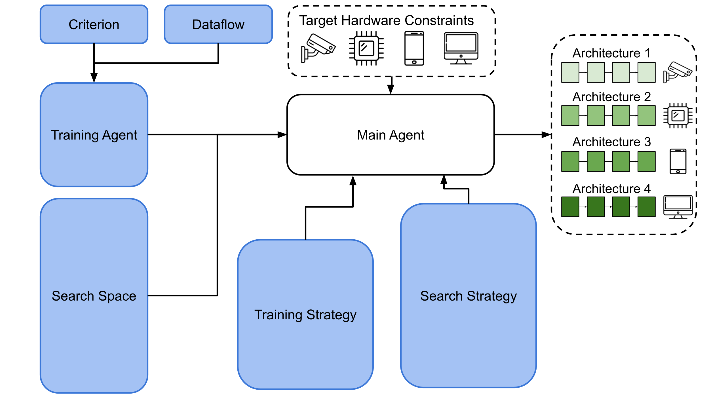

# OSNASLib

## Introduction
OSNASLib is a library for one-shot neural architecture search (NAS). Recently, searching the neural architecture for various deep learning tasks (e.g., semantic segmentation, object detection, and NLP) becomes a common pipeline to improve the performance. Therefore, OSNASLib provides extremely flexible interfaces to allow researchers can incorporate different one-shot NAS algorithms into various specific tasks efficient.


In OSNASLib, we cover various components of one-shot NAS (e.g., search space, search strategy, criterion, dataflow, train agent, and training strategy). You can customize each of them to specific for different tasks and different dataset easily.

We illustrate OSNASLib as the following figure:

> The regions of blue lines are the components that user can customize easily with our interface.

* [What is neural architecture search (NAS)](./doc/nas.md)
* [What is one-shot NAS](./doc/one_shot_nas.md)

### Who Needs OSNASLib?
* NAS beginners who want to build the codebase of baseline one-shot NAS methods quickly.
* Researchers who want to incorporate NAS into various research fields to improve performance.
* Researchers whose research focus is on NAS and want to validate the proposed NAS methods to various tasks (e.g., image classification and face recognition).

**We are glad at all contributions to improve this repo. Please feel free to pull request.**

## Requirements
* Python >= 3.6
* torch >= 1.5.0

Please clone the repo and install the corresponding dependency.
```
git clone https://github.com/eric8607242/OSNASLib
pip install -r requirements.txt
```

## Getting Started
```
python3 main.py -c [CONFIG FILE] --title [EXPERIMENT TITLE]

optional arguments:
    --title                 The title of the experiment. All corrsponding files will be saved in the directory named with experiment title.
    -c, --config            The path to the config file. Refer to ./config/ for serveral example config file.
```
### Classification
``` python3 
python3 main.py -c ./config/classification/uniform_evolution.py --title uniform_sampling_evolution_search
```

### Face Recognition
After searching architecture for face recognition, please download the dataset first.
```bash
bash ./script/facedata_download.sh
```
> Thanks to Johnnylord for the support of face recognition training pipeline.
```bash
python3 main.py -c ./config/face_recognition/uniform_evolution.py --title uniform_sampling_evolution_search
```

More information about configuration please refer to [configuration](./doc/configuration.md).

## Customize NAS For Your Tasks
### Generate Templare
OSNASLib provides extremely flexible interfaces to make researchers can incorporate different components of one-shot NAS for various tasks easily.
For customizing for different components, you will need to generate some code that establishes the component interface - a collection of interface for incorporating with other components.
```
python3 build_interface.py -it [INTERFACE TYPE] --customize-name [CUSTOMIZE NAME] --customize-class [CUSTOMIZE CLASS]

optional arguments:
    -it, --interface-type   The type of the generated interface (e.g., agent, criterion, and dataflow).
    --customize-name        The filename of the customizing interface.
    --customize-class       The classname of the interface class in customizing interface.
```

Please refer to the documents for more detail of customizing.
* [How to customize the criterion](./doc/customize/criterion.md)
* [How to customize the dataloader](./doc/customize/dataloader.md)
* [How to customize the search space](./doc/customize/search_space.md)
* [How to customize the search strategy](./doc/customize/search_strategy.md)
* [How to customize the training strategy](./doc/customize/training_strategy.md)
* [How to customize the agent](./doc/customize/agent.md)

In OSNASLib, we provide the example for serveral tasks. Please reference for following documents for more detail about the example:
* [Classification](./doc/example/classification.md)
* [Face Recognition](./doc/example/face_recognition.md)

## Related Resources
* [AutoDL-Projects](https://github.com/D-X-Y/AutoDL-Projects)
* [Awesome-AutoDL](https://github.com/D-X-Y/Awesome-AutoDL)
* [AutoML.org](https://www.automl.org/)


