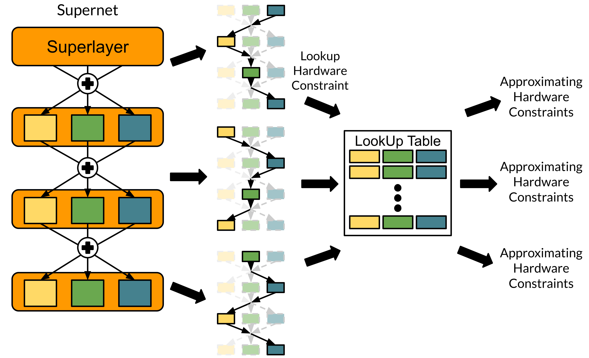

# How To Customize Search Space
For customizing the search space flexibly, we provide the interface of supernet, hardware constraints lookup table and model. By inheriting the interface, the customizing seach space can be incorporated with other components (e.g., search strategy, training_strategy, and criterion) easily. In this document, we will briefly introduce how to customize the supernet, the model and the lookup table for your search space quickly.

## Customizing Components
There are four components you have to implement for your search space : `Superlayer`, `Supernet`, `Model`, and `LookUpTable`.

* `Supernet`: In `Supernet`, user should define the `macro_cfg` and the `micro_cfg` of your search space.
    * `macro_cfg`: The macro configuration of the search space (e.g., layer number, input channels of each layer, and output channel of each layer).
    * `micro_cfg`: The configurations of the candidate blocks in each layer (e.g., kernel size, expansion rate, and activation).
* `Superlayer`: In `Superlayer`, user should define the structure of the supernet in each layer. For example, we can construct the blocks for each candidate configuration directly, or only construct one block to represent the all candidate configurations. Besides, to incorporate for various search strategy, there are lots of methods implement in the abstract class `Superlayer`. For different structure design of the search space, user can override the method to incorporate the search strategy easily.
* `Model`: After searching process, `Model` construct the searched architecture based on the saved best architecture indexs. Therefore, user shoud decode the architecture indexs to build the model within the interface `Model`.
* `LookUpTable`: To make the search process can search for the specific hardware constraints (e.g., FLOPs, latency, and parameter number), `LookUpTable` is the key component for the search space. 

We illustrate the three components as follow figure:


## Generate Interface
```
python3 build_interface.py -t model --customize-name [CUSTOMIZE NAME] --customize-class [CUSTOMIZE CLASS]
```

After generating the model interface, the directory `[CUSTOMIZE NAME]/` will be created in `model/`, and the corresponding files (`__init__.py` and `[CUSTOMIZE NAME]_supernet.py`) are created in the directory `[CUSTOMIZE NAME]/`.

### Interface Struture
```
- model/
    |- [CUSTOMIZE NAME]/
    |         |- __init__.py
    |         |- [CUSTOMIZE NAME]_supernet.py
    |         |- [CUSTOMIZE NAME]_model.py
    |         -- [CUSTOMIZE NAME]_lookup_table.py
            ...
```


## Supernet Interface
For customizing model, the interface class `[CUSTOMIZE CLASS]Supernet` and `[CUSTOMIZE CLASS]Superlayer` in `[CUSTOMIZE NAME]_supernet.py` should inherit the class `BaseSupernet` and `BaseSuperlayer`, respectively. The staticmethod `get_model_cfg` return `macro_cfg` and `micro_cfg`.

To allow each search strategy can search on each seach space. We implement various method in `BaseSuperlayer`. For example, the method `set_activate_architecture()` is utilized by single-path NAS and the method `initialize_arch_param()` is utilized by differentiable NAS. Refer to `./model/base.py` about more detail about the interface for search space design.


```python3
# ./model/[CUSTOMIZE NAME]/[CUSTOMIZE NAME]_supernet.py
from ..base import BaseSupernet, BaseSuperlayer

class [CUSTOMIZE CLASS]Superlayer(BaseSuperlayer):
    def _construct_supernet_layer(self, in_channels, out_channels, stride, bn_momentum, bn_track_running_stats, *args, **kwargs):
        supernet_layer = nn.ModuleList()
        for b_cfg in micro_cfg:
            block_type, kernel_size, se, activation, cfg_kwargs = b_cfg
            block = get_block(block_type=block_type,
                              in_channels=in_channels,
                              out_channels=out_channels,
                              kernel_size=kernel_size,
                              stride=stride,
                              activation=activation,
                              se=se,
                              bn_momentum=bn_momentum,
                              bn_track_running_stats=bn_track_running_stats,
                              **cfg_kwargs
                              )
            supernet_layer.append(block)
        return supernet_layer

class [CUSTOMIZE CLASS]Supernet(BaseSupernet):
    superlayer_builder = [CUSTOMIZE CLASS]Superlayer

    @staticmethod
    def get_model_cfg(classes):
        """ Return the macro and micro configurations of the search space.

        Args:
            classes (int): The number of output class (dimension).
        
        Return:
            macro_cfg (dict): The structure of the entire supernet. The structure is split into three parts, "first", "search", "last"
            micro_cfg (list): The all configurations in each layer of supernet.
        """
        # block_type, kernel_size, se, activation, kwargs
        micro_cfg = []

        macro_cfg = {
                # block_type, in_channels, out_channels, stride, kernel_size, activation, se, kwargs
                "first": [],
                # in_channels, out_channels, stride
                "search": [],
                # block_type, in_channels, out_channels, stride, kernel_size, activation, se, kwargs
                "last": []}
        return macro_cfg, micro_cfg

    def get_model_cfg_shape(self):
        """ Return the shape of model config for the architecture generator.

        Return 
            model_cfg_shape (Tuple)
        """
        return model_cfg_shape

```

### Type Of Candidate Block
In OSNASLib, we provide serveral type of candidate block as follows:
1. MobileNet Block (Inverted residual bottleneck)
2. ShuffleNet Block
3. ShuffleNetX Block
4. MixConv Block
4. Linear (Classifier)
5. Global Average Pooling
6. Conv BN Activation Block
7. Skip Connection Block

You can crate new candidate block in `./model/block_builder.py` by following candidate block interface:
```
def _get_[CUSTOMIZE NAME]_block(in_channels, out_channels, kernel_size,
        stride, activation, se, bn_momentum, bn_track_running_stats, *args, **kwargs):

    return block
```

## LookUpTable Interface
For the different structure of the lookup table, we allow users to redesign the lookuptable flexibly. To customizing the lookup table, the interface class `[CUSTOMIZE CLASS]LookUpTable` should inherit the class `LookUpTable`. In `[CUSTOMIZE CLASS]LookUpTable`, user should re-implement the method `construct_info_table` to construct the info lookup table of search stage in `macro_cfg`. We provide the basic lookup table building method as default and implement lots of useful method to build the lookup table more easily. Please refer to `model/base_lookup_table.py` for more details about useful methods.

> The shape of the `info_table` should same as the shape of the `model_cfg_shape` returned by `Supernet` to calculate the approximating hardware constraints.

```python3
from ..base_lookup_table import LookUpTable
from .block_builder import get_block

class [CUSTOMIZE CLASS]LookUpTable(LookUpTable):
    def construct_info_table(self, info_metric_list=["flops", "param", "latency"]):
        """ Construct the info lookup table of search stage in macro config.

        We provide serveral useful method to calculate the info metric and process info
        metric table. Please refer to `/model/base_lookup_table.py` for more details.

        Args:
            info_metric_list (list):

        Return:
            info_table (dict)
        """
        input_size = self.get_search_input_size()
        info_table = {metric: [] for metric in info_metric_list}

        for l, l_cfg in enumerate(self.macro_cfg["search"]):
            in_channels, out_channels, stride = l_cfg
            layer_info = {metric: [] for metric in info_metric_list}

            for b, b_cfg in enumerate(self.micro_cfg):
                block_type, kernel_size, se, activation, kwargs = b_cfg
                block = get_block(block_type=block_type,
                                  in_channels=in_channels,
                                  out_channels=out_channels,
                                  kernel_size=kernel_size,
                                  stride=stride,
                                  activation=activation,
                                  se=se,
                                  bn_momentum=0.1,
                                  bn_track_running_stats=True,
                                  **kwargs
                                  )

                block_info = self._get_block_info(
                    block, in_channels, input_size, info_metric_list)
                layer_info = self._merge_info_table(
                    layer_info, block_info, info_metric_list)

            input_size = input_size if stride == 1 else input_size // 2
            info_table = self._merge_info_table(
                info_table, layer_info, info_metric_list)


        return info_table
```

## Model Interface
After searching process, OSNASLib save the best architecture as a ndarray vector, which is the index of candidate block in each layer. Therefore, with different structure of the search space, user should implement different decode method to construct the model based on the architecture indexs. In the interface `Model`, user only need to implement the method `_construct_stage_layers()` to construct the search stages, and return a `nn.Sequential` object. With the implementation, the model will construct other stages automatically.

```python3
import torch.nn as nn

from ..base_model import BaseModel
from ..block_builder import get_block


class {{customize_class}}Model(BaseModel):
    def _construct_stage_layers(self, architecture, bn_momentum, bn_track_running_stats, *args, **kwargs):
        """ Construct searched layers in entire search stage.

        Return:
            stages (nn.Sequential)
        """
        return stages
```


## Setting Config File
After customizing for your search space, you can utilize your search space by setting the search space into the config file easily.
```
agent:
    search_space_agent: "[CUSTOMIZE CLASS]"
```
