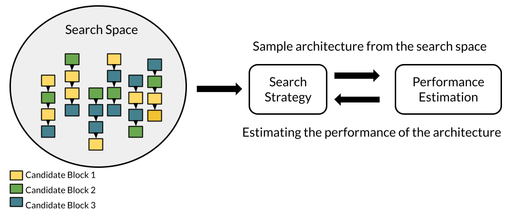

# What Is Neural Architecture Search (NAS)

## Table of Contents
* [What Is Neural Architecture Search (NAS)](./nas.md)
* [What Is One-shot NAS](./one_shot_nas.md)

By now, deep learning networks has brought surprising advances in various research field (e.g., image classification, semantic segmentation, and object detection). However, it is very difficult to design a good neural architecture for a specific hardware constraint (or devices with limited hardware resource), which requires much domain knowledge and lots of time. To reduce the effort of designing neural architecutre and get the better neural architecture, neural architecture search (NAS) has recevied much attention in recent years.

## Three Major Components In NAS
Generally NAS methods can be categorized according to three dimensions: search space, search strategy, and performance estimation strategy.

### Search Space
The search space includes the set of architectures that are considered in the search process. The most common configurations in the search space are kernel size, layer size, and channel size. For example, for VGG16, the search space size is 3\*\*16 if the kernel size in each layer can be implemented by {3, 5, 7}. Designing the search space requires much human intervention. A small search space may possibly exclude the global optimal architecture. 

The common search spaces in recent years are constructed by the inverted residual blocks with linear bottlenecks (MobilenetV2) or the DAG search space (DATRs).

### Search Strategy
Given a search space, the objective of NAS is to **search the best architecture under the specific hardware constraint**. The search strategy means the strategy to explore the search space and search the best architecture (e.g., random search, grid search, and evolution algorithm). A good search strategy would facilitate efficiently searching the best architecture. 

### Performance estimation strategy
With the search strategy, **how can we evaluate the architectures in the search space? In other words, how do we know the performace of each architectures?**. For the performance estimation strategy, we mean that the objective or the components used to approximate the truth-performance of candidate architectures (e.g., accuracy predictor, and proxy training strategy), which is still very challenging recently.

