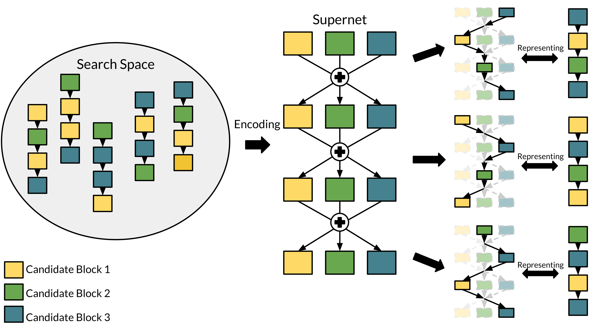
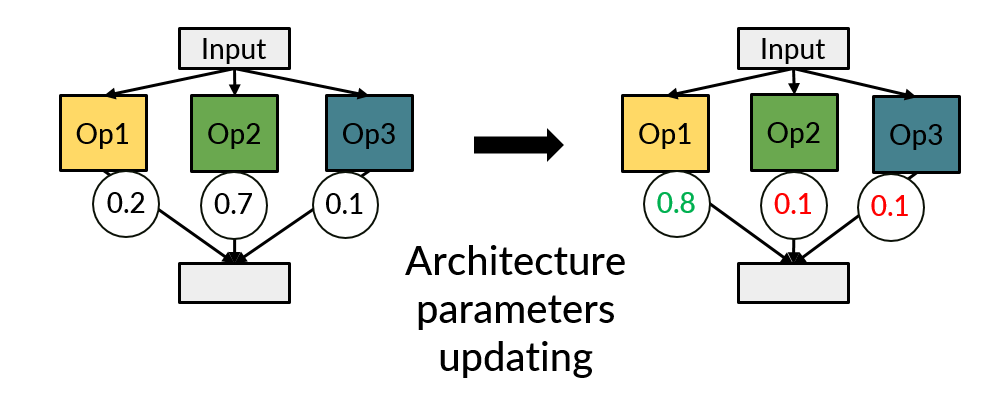
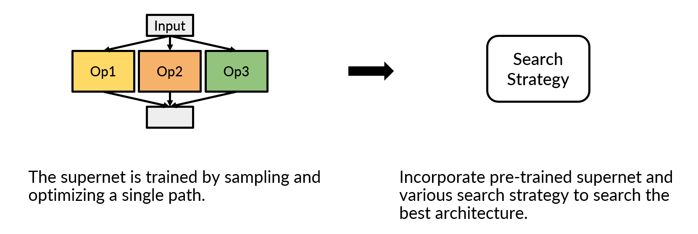

# What Is One-shot NAS 

* [What Is Neural Architecture Search (NAS)](./nas.md)
* [What Is One-shot NAS](./one_shot_nas.md)

To improve searching efficiency, many recent NAS approaches are based on one-shot scheme. Instead of training thousands of architectures to get the true performance of the entire search space, the main idea of one-shot NAS is constructing a supernet to represent performance of the entire search space. Therefore, the term 'one-shot' in one-shot NAS means that only one neural architecture needs to be trained to evaluate the entire search space. Once the supernet is trained, all sub-networks in the supernet can be evaluated by inheriting the weights of the supernet without additional training. To demonstrate the details of how a supernet works, we illustrate supernet construction in the following figure.

> Illustration of supernet construction. The blocks in different colors denote the blocks of different configurations in the search space (e.g., convolution blocks with different kernel sizes {3, 5, 7}). In the supernet, all candidate blocks are constructed layer by layer. Therefore, by activating different blocks in different layers, the supernet can represent all architectures in the entire search space easily.

Therefore, how to train a supernet and how to search the best architecture are very important for one-shot NAS. Such one-shot methods can be generally divided into two categories: differentiable NAS and single-path NAS. Below we will briefly introduce differentiable NAS and single-path NAS.

## Differentiable One-shot NAS
Given a supernet  represented by weights , to find an architecture that achieves the best performance while meeting a specific hardware constraint, we need to find the best sub-network  from  which achieves the minimum validation loss . Sampling  from  is a non-differentiable process. To optimize  by the gradient descent algorithm, DNAS relaxes the non-differentiable problem as finding a set of continuous architecture parameters . Some methods compute the values for weighting output of candidate blocks by the softmax function:

where  is the input tensor of the -th layer,  is the -th block of the -th layer, and thus  denotes the output of the -th block. The term  is the weight of the -th block in the -th layer. The value  is the weight for the output . 

Some methods compute the values for weighting output of candidate blocks by the Gumbel softmax function: 

where the term  is a random variable sampled from the Gumbel distribution , and  is the temperature parameter.

After relaxation, DNAS can be formulated as a bi-level optimization: 

where  is the training loss. 

Because of the bi-level optimization of $\boldsymbol{w}$ and $\boldsymbol{\alpha}$, the best architecture $\boldsymbol{\alpha}^*$ sampled from the supernet is only suitable to a specific hardware constraint. With this searching process, for $N$ different hardware constraints, the supernet and architecture parameters should be retrained for $N$ times. This makes DNAS less flexible. 

We illustrate the architecture parameters updating in the following figure.

## Single-path One-shot NAS
Single-path methods decouple supernet training from architecture searching. For supernet training, only a single path consisting of one block in each layer is activated and is optimized in one iteration to simulate discrete neural architecture in the search space. We can formulate the process as: 

where 
 denotes the subset of  corresponding to the sampled architecture , and  is a prior distribution of 
 (e.g., uniform distribution). The best weights  to be determined are the ones yielding the minimum expected training loss. After training, the supernet is treated as a performance estimator to all architectures in the search space. With the pretrained supernet weights , we can search the best architecture 
: 

Single-path methods are more flexible than DNAS, because supernet training and architecture search are decoupled. Once the supernet is trained, for $N$ different constraints, only architecture search should be conducted for $N$ times.

We illustrate the single-paht NAS the following figure.

