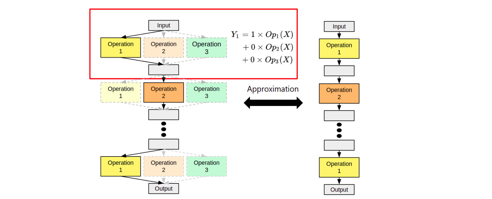

* [What is neural architecture search (NAS)](./nas.md)
* [What is one-shot NAS](./one_shot_nas.md)

# What is one-shot neural architecture search?
Deep neural networks have brought suprising advances in various research field (e.g., classification, object detection, and semantic segmentation). However, it is very difficult to design a good neural architecture for a specific hardware constraint (or devices with limited hardware resource), which requires much domain knowledge and lots of time. To reduce the effort of designing neural architecutre and get the better neural architecture, neural architecture search (NAS) has recevied much attention in recent years.
To improve the search efficiency of earliest NAS which evaluate each architecture by training it from scratch, one-shot NAS methods were proposed to encode the entire search space into an over-parameterized neural network, called ***supernet***. The "one-shot" in one-shot NAS means that the only neural architecture needs to be trained to evaluate the entire search space instead of training each architecture from scratch. Once the supernet is trained, all sub-networks in the supernet can be evaluated by inheriting the weights of the supernet without additional training. One-shot NAS methods can be divided into two categories : differentiable NAS (DNAS) and single-path NAS.

We visualize the supernet in the following figure. There are lots of candidate neural architecture in the search space. We encode each candidate neural architecture into the supernet. For example, operation1, operation2, or operation3 can be implemented in each layer to construct the architecture. All candidate operations will be constructed in each layer of the supernet.

Once we activate different operation in each layer of supernet, we can approximate all candidate architectures in the search space within one supernet.

## Differentiable one-shot neural architecture search
Differentiable neural architecture search (DNAS) searches the best neural architecture by gradient descent. However, searching process is non-differentiable because the architectures in search space are discrete. To search the best architecture by gradient descent, DNAS utilizes additional differentiable parameters, called ***architecture parameters***, to indicate the architecture distribution in the search space. Besides, to make architecture parameters can indicate **the best architecture under the specific hardware constraint**, DNAS optimizes the architecture parameters with **the hardware constraint loss and cross entropy loss** at the same time. With the architecture parameters and the supernet, DNAS jointly optimize both of them to search the best architecture.

We illustrate the differentiable NAS in the following figure. In the situation, the operation1 is the best operation. DNAS utilize a additional architecture parameter to indicate the best architecture. After updating the architecture parameters, the architecture parameters focus on the operation1 to contribute more performance to the loss function.

## Single-path one-shot neural architecture search
Instead of utilizing additional differentiable architecture parameters as DNAS, single-path NAS decouples the entire searching process into two parts, supernet training and architecture searching. For supernet training, only a single path consisting of one block in each layer is activated and is optimized in one iteration. The advantage of only training single path is to simulate discrete neural architectures in the search space and save GPU memory consumption. After supernet training, different search strategies (e.g., evolution algorithm, or random search) can be used to search the architecture under different hardware constraints.
