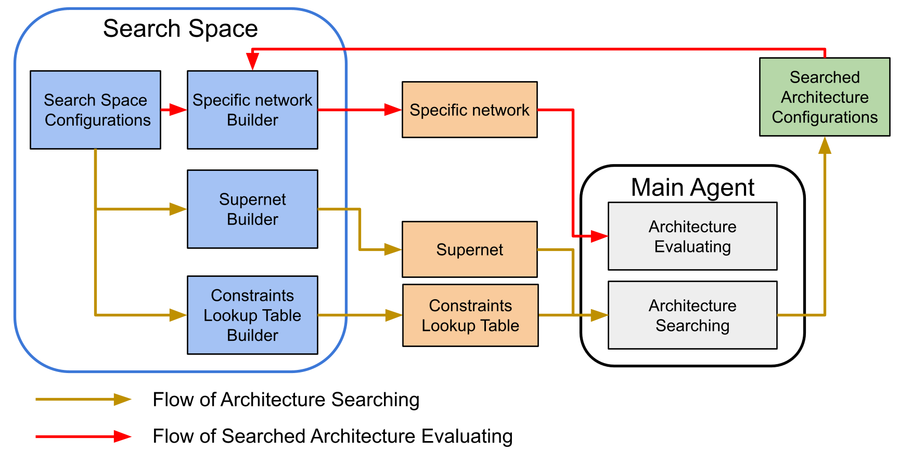

# The major components in OSNASLib
## Training agents
We observe that including NAS methods into deep neursal networks for specific tasks has emerged recently. However, for different tasks like image classification or object detection, different training pipelines may be needed to proceed the NAS process. To make the developed OSNASLib more flexible, we decouple the training pipeline from the entire NAS process. With this isolation, OSNASLib allows users to focus on implementing details of the training pipeline like forward/backward parameter updating, which is called **training agent**. After this implementation, OSNASLib incorporates the training agent with the pre-defined searching pipeline, called main agent, to search the best neural architecture for the targeted task automatically.

## Criterion
Cooperating with the training agent, users can customize various loss functions for the targeted task. The component for defining loss functions is called **criterion** in OSNASLib. Separating this component from the training agent is also due to the consideration of flexibility. 

## Dataflow
For different tasks and different datasets, data pre-process or specific data loading schemes are needed to be done case by case. OSNASLib allows users to customize the dataflow by designing appropriate pre-processing,  different data samplers, or different data loaders. With this isolation, users can apply NAS methods on different datasets with the same OSNASLib components easily.

## Search space
Search space is a very important component in NAS. A small search space may possibly exclude the global optimal architecture. In OSNASLib, we allow users to customize the search space for different application scenarios where different hardware resources may be available.

We illustrates structure of the search space component in OSNASLib as following:

> Structure of the search space. With the provided interface (blue regions), users can define various search spaces by setting different supernet structures and different search space configurations.

To define the search space, users should configure a supernet and a hardware constraints lookup table. In the supernet, configurations of the search space like candidate blocks of each layer, and input and output channel sizes of each layer, should be set. Based on the configurations, the main agent constructs the supernet for architecture search. With the provided interface, it is flexible to implement different supernet structures. 

To search architectures under various hardware constraints, OSNASLib evaluates the "hardware cost" of the sub-network  in the supernet as:

where the term  is a constant cost of the block in the th layer of . For each search space, OSNASLib should construct a hardware constraint lookup table to store the hardware constraint of each candidate block in each layer. The goal of utilizing this lookup table is to evaluate the hardware cost quickly, which has been widely adopted in many one-shot methods 

After architecture searching, OSNASLib builds the model from the searched architecture configurations (e.g., kernel size and expansion rate) to evaluate the architecture performance for the specific task by training from scratch.

## Training strategy
One-shot NAS utilizes the supernet to estimate performance of architectures in the search space. Therefore, how to train supernet well is very important. A poor supernet may mislead the entire search process and good architectures may not be found potentially.

The supernet training strategy can also be customized by users in OSNASLib. By implementing functional details based on the generated interfaces, users can focus on the development of the supernet training strategy without the distraction of other components. 

## Search strategy
Given a supernet , a search strategy aims at searching the best architecture $a$ from the search space under a target hardware constraint . That is,

where  denote the weight of the supernet,  denotes the validation loss,  denotes the hardware constraint of the architecture  calculated by , and  denotes the subset of  corresponding to the sampled architecture . 

It is important to design a search strategy that can efficiently search the best sub-network from the supernet. OSNASLib also offers flexibility for users to customize the search strategy. With the provided interfaces, users can implement their search strategies or utilize the default strategies. It is easy and fair to compare their proposed search strategies with the baseline strategies provided in OSNASLib. 
